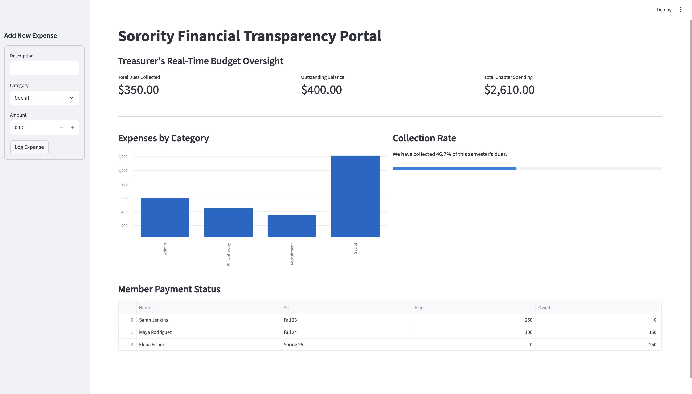

# 📊 Chapter Financial Transparency Dashboard

### **Automated Budget Oversight & Member Dues Management**

## Project Overview
As Chapter Treasurer, I managed a complex annual budget involving significant dues and expenses. To move beyond manual spreadsheets, I built this **Full-Stack Financial Dashboard**. This tool provides a "Single Source of Truth" for the executive board, offering real-time visibility into chapter liquidity, collection rates, and spending trends.
## 📸 Live Demo
Below is a preview of the interactive dashboard showing real-time financial analytics and the transaction management interface:

---

## Tech Stack
* **Backend:** Python & SQLAlchemy (ORM for relational data modeling)
* **Database:** SQLite (Ensures data persistence and integrity)
* **Data Logic:** Pandas (Used for real-time financial aggregation and calculations)
* **Frontend:** Streamlit (A reactive web interface for interactive data exploration)

## Key Features
* **Live Financial Metrics:** Instant calculation of total dues collected, outstanding balances, and total spending.
* **Dynamic Visualizations:** Interactive bar charts grouping expenses by category (e.g., Social, Recruitment, Philanthropy).
* **Dues Progress Tracker:** A visual collection rate bar to monitor chapter income status.
* **Accountability Table:** A searchable breakdown of member payment status and PC year.
* **Transaction Logging:** A sidebar interface to log new expenses directly into the database without touching code.

---

## Installation & Setup

To run this dashboard on your own machine, follow these distinct steps:

### **1. Clone the Project**
First, download the code to your computer:
`git clone https://github.com/ilanasydney886-debug/sorority-finance-dashboard.git`
`cd sorority-finance-dashboard`

### **2. Install Dependencies**
This installs the specific tools like Pandas and Streamlit needed for the app:
`pip install -r requirements.txt`

### **3. Initialize the Database**
Run the seed script to create your local database file and add sample data:
`python3 seed.py`

### **4. Launch the Portal**
Start the web server to view your financial dashboard in your browser:
`python3 -m streamlit run app.py`

---

*Developed by Ilana Sydney — Leveraging technology to enhance organizational leadership.*
